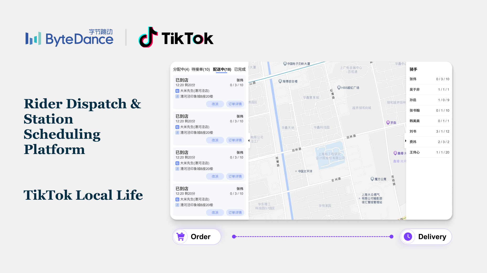
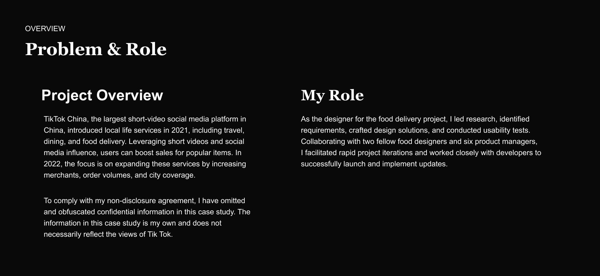
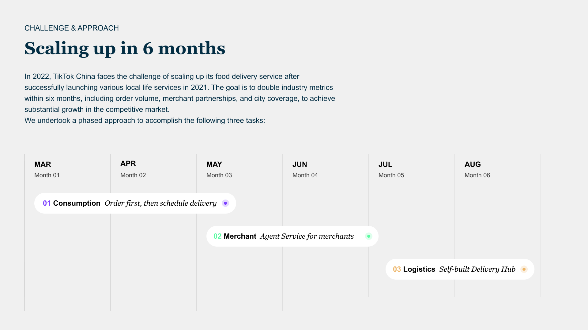
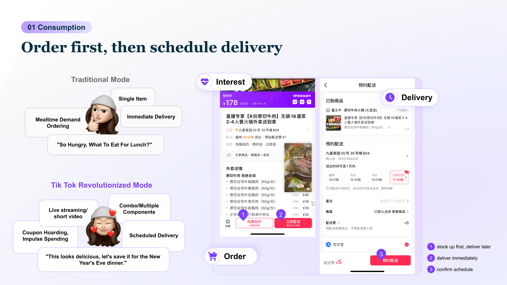
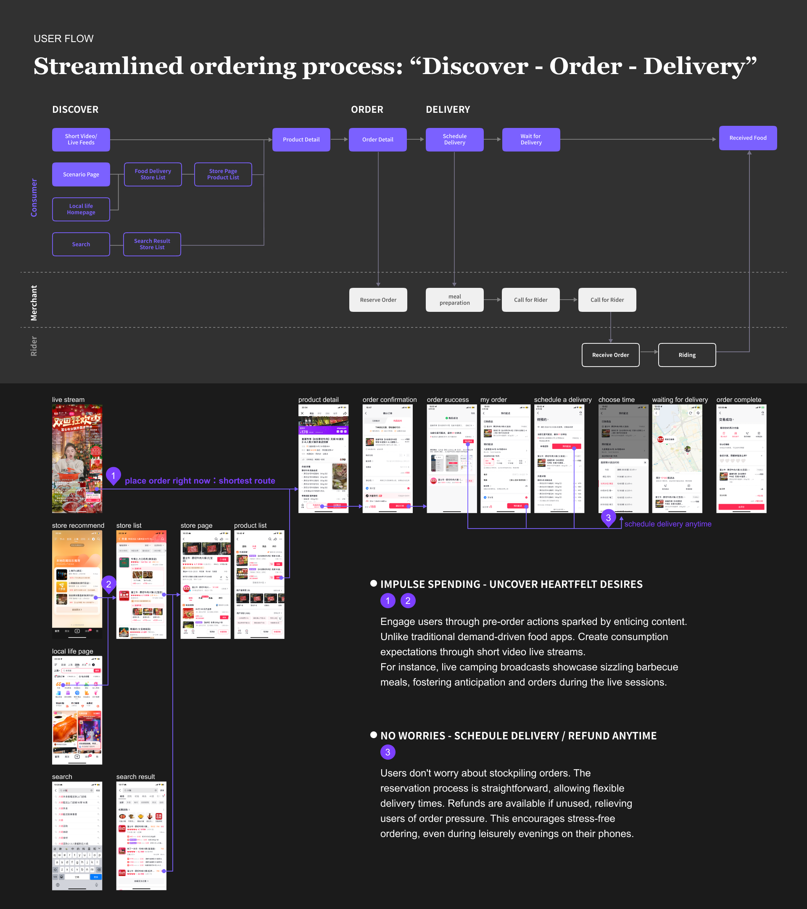
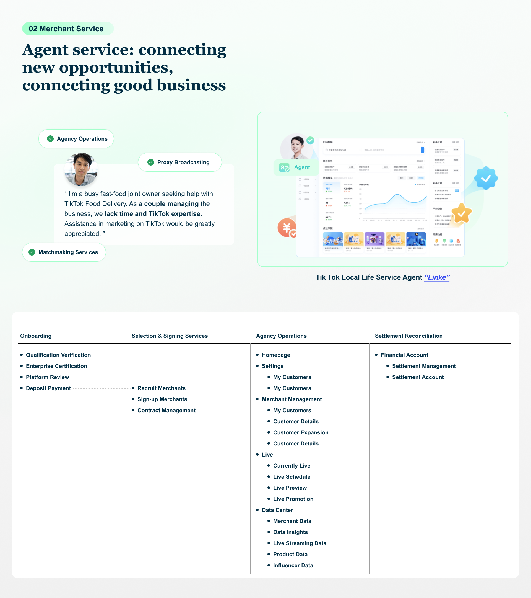

# Content-Driven Food Delivery Experience

### Project Brief
- Date: 2023
- Project Name: Content-Driven Food Delivery Experience
- Tag: Content Commerce, UX Flow, Incentive Design
- Company: TikTok, Local Life

### Overview

TikTok’s Local Life team aimed to reinvent how people discover and order food — not through static restaurant lists, but through emotion-driven content.
Users could watch short videos or join live streams from merchants, feel inspired, and place an order directly within the content interface.
I led the product design for the new “Order First, Then Schedule Delivery” experience — an innovative mechanism that bridges content engagement and food delivery conversion.

### Suggested Visuals

- Flow diagram: “User watches Live → Collects Voucher → Redeems Later → Delivery”
- Screenshot mock of live-stream with “Order Now” or “Collect Voucher” overlay

### Challenge

Traditional delivery apps rely on intent-based behavior (search → compare → order).
However, TikTok’s content ecosystem operates on impulse and inspiration — users are emotionally triggered but rarely hungry right now.

The challenge was:

“How can we capture users’ desire in the content moment, and convert it into real consumption later?”

### Suggested Visuals

- Comparison chart: “Intent-driven vs Emotion-driven funnel”

### Process

#### 1️⃣ Mapping the Cross-Domain Flow
Worked with commerce, live-stream, and delivery teams to align three systems:

- Live content vouchers
- User voucher wallet
- Delivery ordering flow

#### 2️⃣ Designing the ‘Order Later’ System
We created a feature allowing users to collect and store discounted meal vouchers during a live session, and later redeem them when placing food orders.
This turned “ephemeral emotion” into “stored intent,” extending the lifecycle of engagement.

#### 3️⃣ A/B Testing Conversion Triggers
Tested different redemption reminders (push, in-feed cards) to optimize timing for conversion.
Result: increased live-to-order retention and overall GMV uplift (confidential, but significant).

### Outcome

- Improved post-live order conversion and repeat user rate
- Established a reusable framework for other verticals (beauty, retail)
- Demonstrated TikTok’s potential to link “content → intent → transaction”

### Reflection

This project taught me how to merge UX empathy with business mechanism thinking — understanding not only what users feel but how to capture that moment sustainably.
