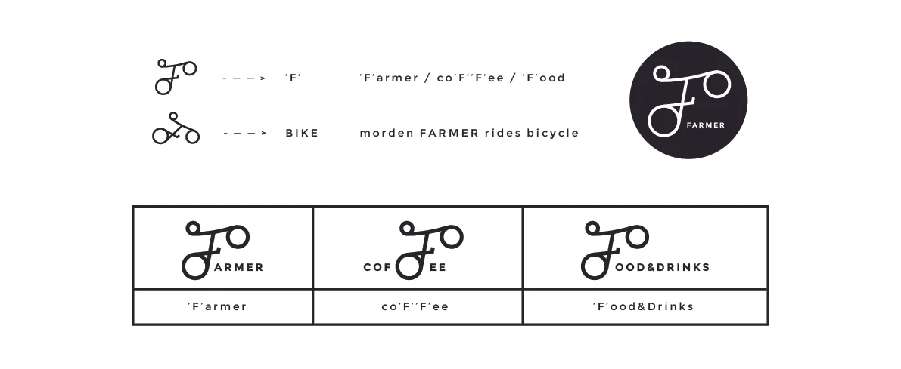
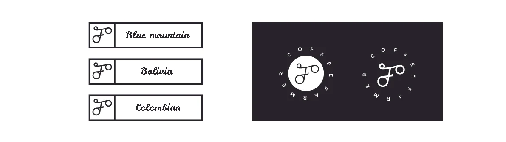
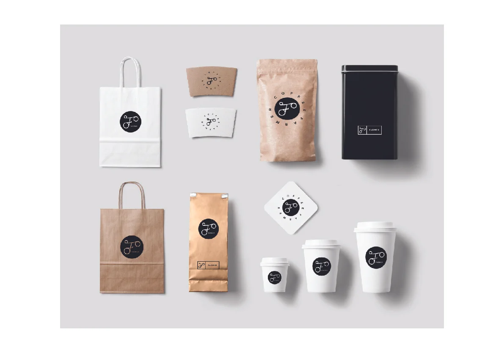
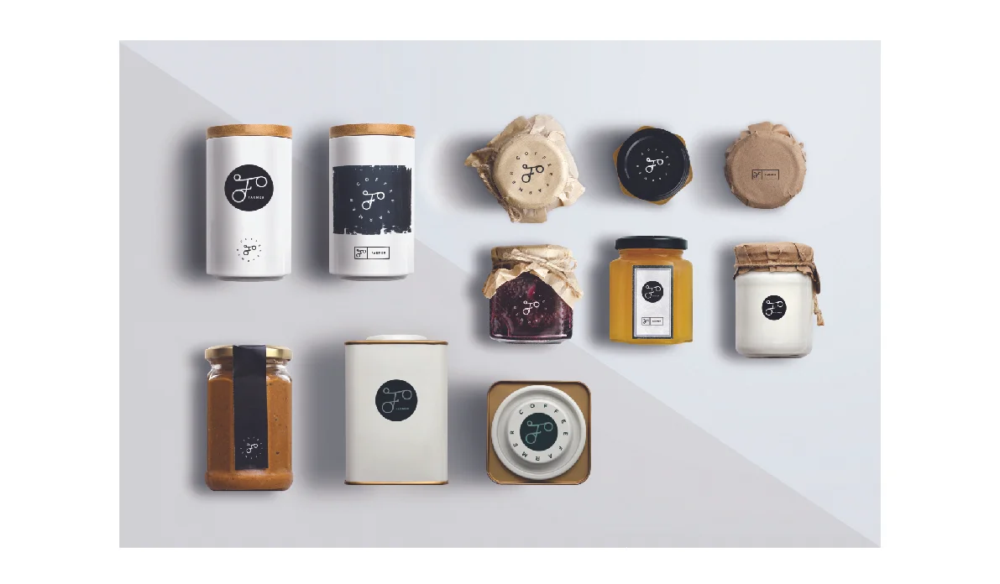
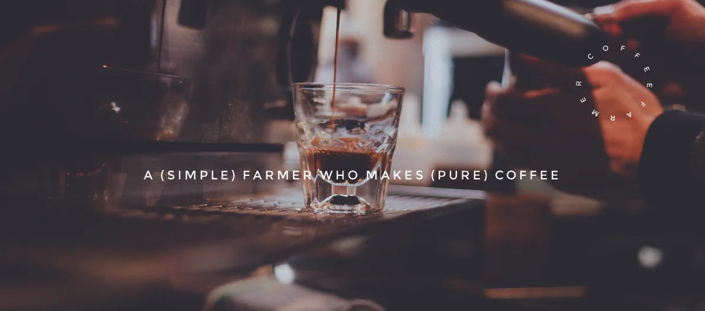

# Farmer Coffee Logo Design

---

### Project Brief
- Date: 2018-05-30
- Project Name: Farmer Coffee Logo Design
- Tag: Visua Identitty Design
- Company: Farmer Coffee

### Overview
Farmer Coffee is a small café located in Shanghai, founded by a barista who proudly identifies as a farmer. Although he now works in a modern city, he sees no contradiction between his rural roots and urban lifestyle — instead, he takes pride in that identity. His philosophy is about craftsmanship, humility, and persistence, values that mirror how he makes coffee: patiently, manually, and with attention to every detail.
My goal was to create a logo that visually connects this dual identity — a modern urban craftsman with a farmer’s spirit.

### Concept
During our conversation, the founder said:
*"I may live in the city now, but I’ll always be a farmer — and I’m proud of it."*
That sentence became the soul of the logo. I wanted to capture this tension between rural roots and urban rhythm.

The word “Farmer” feels grounded, honest, and earthy.
But in Shanghai, this “Farmer” rides a bicycle to work every day, symbolizing freedom, motion, and sustainability.
So I began exploring how the letter “F” could visually echo the form of a bicycle — a minimal, continuous line that carries a sense of movement, balance, and human touch.
The “F” became not just a letterform, but a symbol of mobility and humility — a farmer pedaling through the city.

### Design Process
Started from hand-drawn variations of “F” that could resemble a bicycle frame or handlebar. Explored the balance between readability and symbolism.

### Final Outcome
The final identity strikes a balance between urban simplicity and rural authenticity. It feels clean enough for a modern café in Shanghai, yet warm and human — just like the founder himself.
