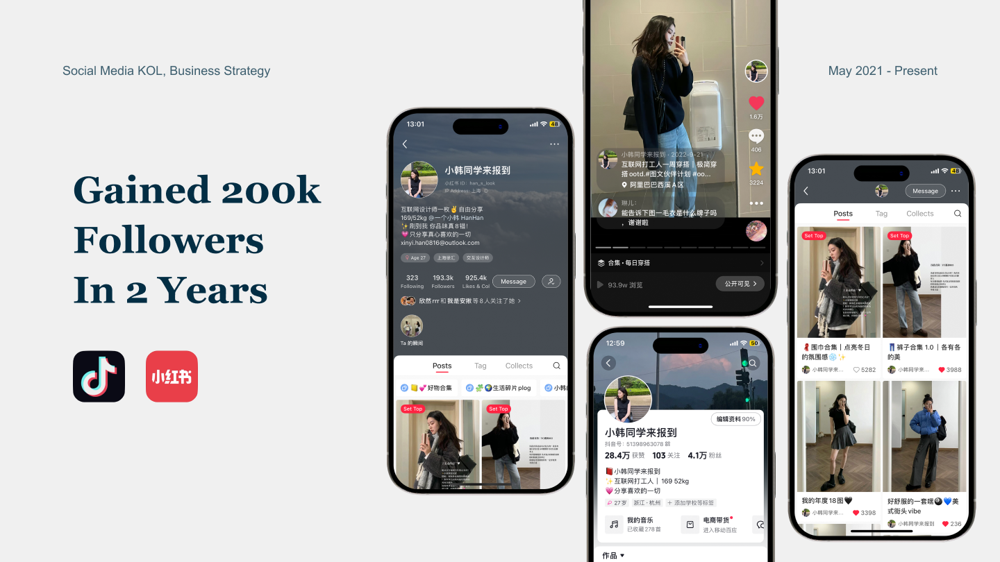

# Social Media: From 0 to 50,000+ Fans

---

### Project Brief
- Date: 2021-11-01
- Project Name: KOL Growth Strategy
- Tag: Social Media, User Growth
- Company: Red Note

---

### Overview
#### Everyday life as a fashion runway

Created the Xiaohongshu account Xiao Han Student Reports, gained over 200k followers in 2 years, specializing in daily fashion and style sharing. Collaborated with various brands to launch products, including Adidas, Uniqlo, Vans, etc. Earned a commercial return of about 100,000 USD.

---

### Data Tracking

I identified a new demand among women for athletic wear that integrates with the rhythm of daily life, blending into everyday casual outfits, not just for fitness. Consequently, I set the scenes in representative locations like 'supermarkets,' 'urban street views,' and 'cycling,' capturing leisure-style pairings that blur the lines between sportswear and everyday wear. The post successfully garnered 5,000 interactions.

---

### Growth Strategy

The three stages of social media conversion:

**Discovery → Conversion → Fandom**

