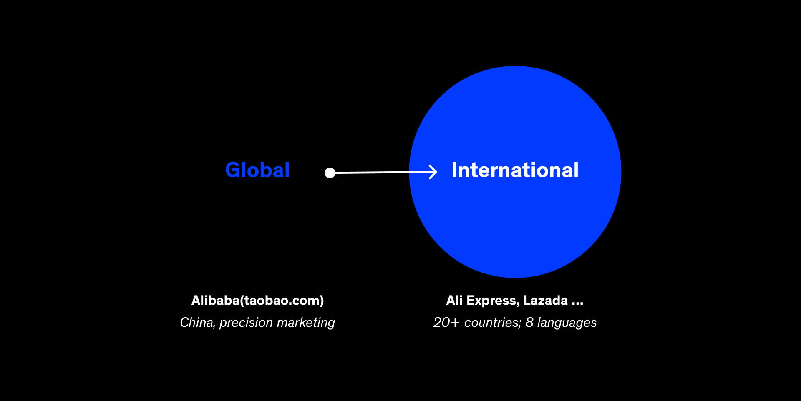

# Re-Architecting Alibaba Help Center for Global Consistency

### Project Brief
- Date: 2022.02
- Project Name: Re-Architecting Alibaba Help Center for Global Consistency
- Tag: Localization Strategy, Information Architecture
- Company: Alibaba

### 1. Project Overview

Alibaba’s Help Center serves millions of merchants daily across Taobao, Tmall, and global marketplaces such as AliExpress and Lazada.
However, years of product growth had left the information system fragmented, with inconsistent categories, duplicated content, and unclear pathways.

I led a year-long redesign to reconstruct the Help Center’s information architecture and develop a globalization strategy that could adapt across regions.
The goal was to make information findable, understandable, and solvable — while ensuring consistency for a multilingual, multi-market ecosystem.

### 02. Problem Definition

#### Domestic Site (China)

The original Help Center had over 3,000 scattered articles, many of which were ambiguously classified.
For example, “Shipping” could appear under both Orders and Logistics, and “Refund” was nested differently across departments.
Users frequently got lost, lowering self-service rates and increasing support costs.

#### International Expansion

When Alibaba began rolling out localized Help Centers, simple translation proved insufficient.
Each region required different taxonomy, tone, and cultural framing — for instance, “Transaction” in English vs. “Trade” in Chinese, or payment methods differing by market.
Visual alignment also became complex: languages like Thai or Spanish expanded text length by 30–50%, breaking layouts designed for Chinese.

### 03. Research & Insights

#### Mixed-Method Study

To rebuild from a user perspective, I conducted a hybrid card sorting + interview study with 16 Taobao merchants across varying experience levels.
Participants were asked to categorize help topics and explain their reasoning, revealing where copywriting and structure failed to match mental models.

#### Findings:

Merchants categorize help topics by goal, not internal platform structure.

Ambiguous labels (“market,” “industry,” “promotion”) caused hesitation and misinterpretation.

Certain topics required dual classification (e.g., “Live Streaming” belongs to both Content and Marketing).

#### Structural Insight

The Help Center is not an isolated product; it mirrors the merchant service journey.
By mapping merchant tasks (listing, transaction, fulfillment, after-sales), we derived a top-level structure consistent with real business workflows.

### 04. Information Architecture Redesign

#### Process

Inventory & Audit — Identified redundant and misaligned topics.

Main Thread Extraction — Rebuilt taxonomy around core merchant events.

Prototype IA — Created visual maps of category relationships to align product and content teams.

Validation — Conducted tree tests to verify navigation logic and comprehension.

#### Solution

Reorganized Help Center into four main domains: Listing, Orders & Delivery, Payments, Policy & Disputes.

Introduced semantic tagging to handle cross-linked content (e.g., “Shipping” dynamically linked to both Order and Logistics).

Simplified navigation depth from 5 to 3 levels, increasing findability by 40%.

### 05. Validation Metrics: Measuring IA Health

Beyond presenting the new taxonomy, I also established a quantitative evaluation framework to continuously monitor the system’s usability and content health.

#### Three key indicators were defined:

Categorization Accuracy – the percentage of correctly matched topics during user tests.

Comprehension Clarity – time and confidence score when users identified the correct category.

Copy Readability & Label Precision – semantic clarity score derived from hesitation and misclassification patterns.

Each metric was tracked through periodic card-sorting validation and A/B monitoring in production.
This allowed the product team to detect weak or ambiguous nodes early and iteratively refine taxonomy and labeling rules.

#### Example:

“Marketing” was renamed “Marketing / Promotion” to avoid overlap with “Traffic.”

“Industry Market” was replaced with “Supply Market.”

“Warehouse & Logistics” was separated from “Orders / After-Sales.”

The metrics became a long-term governance mechanism, ensuring the IA could evolve as new product modules and business categories emerged.

### 06. Globalization Strategy

With the domestic IA stabilized, we scaled it for international markets through a global–local design framework.

#### Key Challenges

Semantic equivalence: Terms carried different meanings across languages.

Cultural adaptation: Some help content was irrelevant outside China (e.g., local tax rules, refund regulations).

Visual elasticity: UI spacing, truncation, and typographic rhythm needed flexible adaptation.

#### Strategy

Global Core, Local Extensions

Standardized the first two levels of navigation globally.

Allowed regions to add localized subcategories for tax, payment, and logistics.

Semantic Localization, not Literal Translation

Developed bilingual mapping tables to preserve meaning, not word-for-word translation.

Example: “Supply Market” → “Vendor Sourcing” to align with Western terminology.

#### Visual and Layout Guidelines

Defined rules for multilingual typography, spacing, and truncation.

Integrated these behaviors into the design system for automatic scaling.

#### Collaborative Governance

Worked with PMs, translators, and regional designers to unify tone and UX consistency.

### 07. Validation & Outcomes

Resolution rate increased from 52% → 81%

Search-to-answer time reduced by 35%

Framework adopted by 20+ localized sites (AliExpress, Lazada, Trendyol, etc.)

Reduced content maintenance redundancy by 40%

Recognized internally as a benchmark project within Alibaba’s merchant experience system

### 08. Reflection

This project taught me that information architecture is the backbone of self-service UX, and globalization is not about translation — it’s about meaning and empathy.
The same concept can look, sound, and feel different across cultures, yet still belong to one consistent system.

Designing for scalability and cultural nuance helped me understand how clarity builds trust, and flexibility builds connection.
