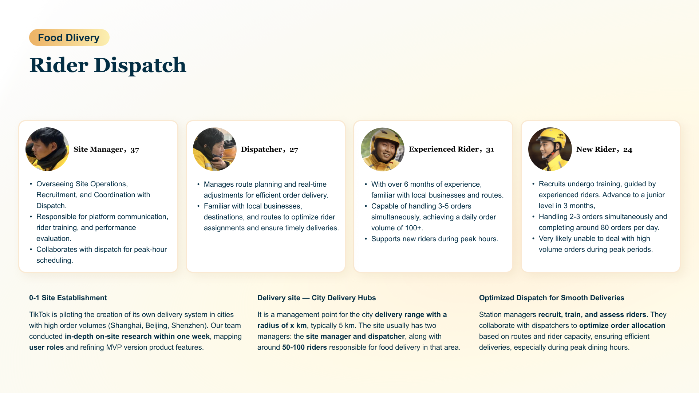

# Rider Dispatch & Scheduling Platform

### Project Brief
- Date: 2023
- Project Name: Rider Dispatch & Scheduling Platform
- Tag: B2B Platform, Operations Design, Efficiency Optimization
- Company: TikTok, Local Life

### Overview
While TikTok’s front-end experience focused on users’ desire-driven orders, the backend needed an equally powerful delivery infrastructure.
I led the design of a dispatch and scheduling platform for local delivery stations — helping managers assign riders efficiently, track orders in real-time, and visualize delivery routes.
This platform empowered on-ground logistics, mirroring B2B systems like Zendesk or Salesforce Workspaces but tailored for TikTok's ecosystem.

### Challenge

TikTok's delivery network was expanding rapidly, yet local dispatch relied on manual coordination through chat groups or spreadsheets. This led to:

- Slow response during peak hours
- Imbalanced workloads among riders
- Lack of visibility on route efficiency

The key problem:

"How might we help delivery station managers schedule riders dynamically, balancing speed, cost, and fairness?"

### Process
#### 1. System Mapping
Interviewed station managers and riders to identify inefficiencies. Mapped the information flow from "order generation" → "rider assignment" → "delivery tracking."

#### 2. Platform Architecture
- Order Board: All pending orders by area/time window
- Rider View: Real-time status, route, capacity
- Smart Scheduling: Reassignment suggestions based on proximity and workload

#### 3. Interface & Interaction Design
Adopted a "command-center" UI layout with priority color tags and drag-to-assign actions. Enabled real-time updates with minimal cognitive load for dispatchers.

### Outcome

- Reduced average dispatch time per order
- Improved rider utilization and delivery punctuality
- Provided a scalable template for other local service categories (laundry, beauty, grocery)

### Reflection
This project shifted my mindset from consumer UX to operational systems thinking — designing for speed, clarity, and decision support, not just aesthetic or emotion.
