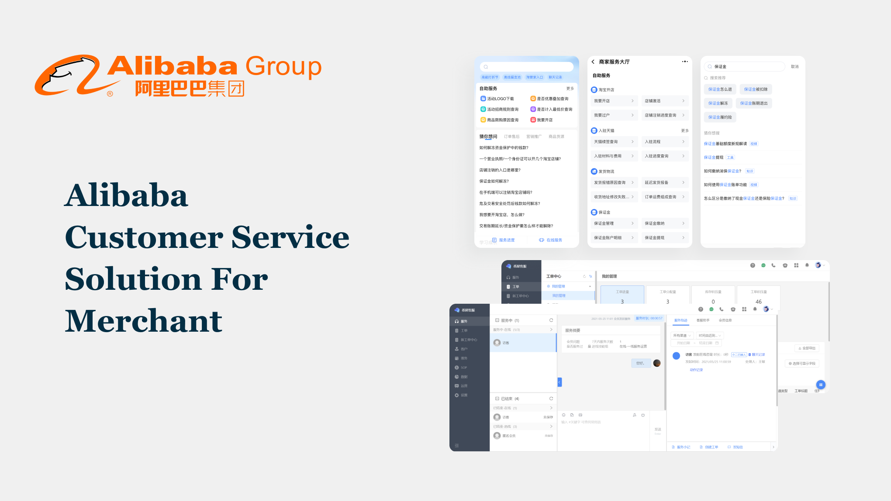

# Customer Service Workspace & AI Chatbot

### Project Brief
- Date: 2021.06
- Project Name: Customer Service Workspace & AI Chatbot
- Tag: UX Design, AI Chatbot, Customer Service
- Company: Alibaba

### Overview

Designed a comprehensive customer service solution for Taobao, China's largest e-commerce platform, handling 200,000 daily inquiries from sellers and buyers. The project encompassed two interconnected systems: an agent workspace for the platform CS team and a customer-facing AI chatbot for self-service support.

The dual-system approach addressed the needs of two distinct user groups while maintaining seamless integration. The agent workspace provided CS representatives with case management tools, a centralized knowledge base, and AI-assisted features to handle complex inquiries efficiently. The customer-facing chatbot enabled users to resolve common issues independently through an intelligent conversational interface.

### Challenge

The scale of customer service operations on Taobao presented significant challenges:

- **Volume**: Managing 200,000 daily inquiries across diverse user segments (sellers and buyers) with varying needs and complexity levels
- **Dual User Groups**: Balancing the requirements of professional CS agents who needed powerful tools with customers who wanted simple, quick solutions
- **Efficiency vs. Quality**: Maintaining high-quality support while reducing operational costs and response times
- **Context Awareness**: Ensuring the AI system could understand nuanced customer issues and respond appropriately across different scenarios

### Process

#### Agent Workspace Design

Built an integrated workspace combining case management, knowledge base access, and AI-assisted tools. The interface prioritized quick information retrieval and streamlined workflows to help agents resolve cases faster while maintaining service quality.

Key features included:
- Unified case dashboard with smart prioritization
- Contextual knowledge base suggestions based on inquiry type
- AI-powered response recommendations
- Real-time analytics and performance metrics

#### Customer-Facing Chatbot

Created a tree-based conversational flow system that guided customers through self-service support. The chatbot design focused on natural language understanding and progressive disclosure of information to prevent overwhelming users.

The conversation architecture was structured to:
- Quickly identify user intent and issue category
- Provide step-by-step guidance for common problems
- Seamlessly escalate to human agents when needed
- Learn from interactions to improve future responses

#### NLP Collaboration

Worked closely with the NLP engineering team to develop tone customization and context-aware response systems. This collaboration ensured the chatbot could adapt its communication style based on customer sentiment, issue urgency, and conversation context.

### Outcome

The integrated customer service system delivered measurable impact:

- **80% Resolution Rate**: The majority of customer inquiries were successfully resolved through the chatbot's self-service capabilities
- **Cost Savings**: Millions saved annually in customer support operational costs through automation and improved agent efficiency
- **Innovation Recognition**: Filed patent for AI agent with personalized tone adjustment technology
- **User Satisfaction**: Improved response times and 24/7 availability enhanced overall customer experience on the platform

The project demonstrated how thoughtful UX design combined with AI technology can transform large-scale customer service operations while maintaining the human touch essential for quality support.
