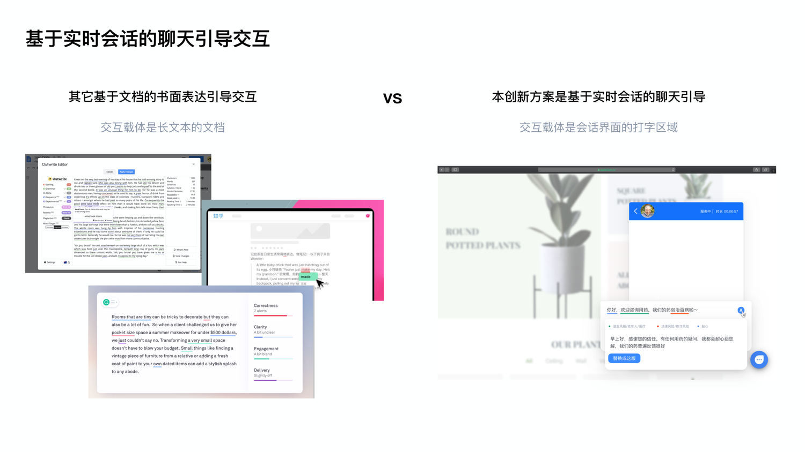
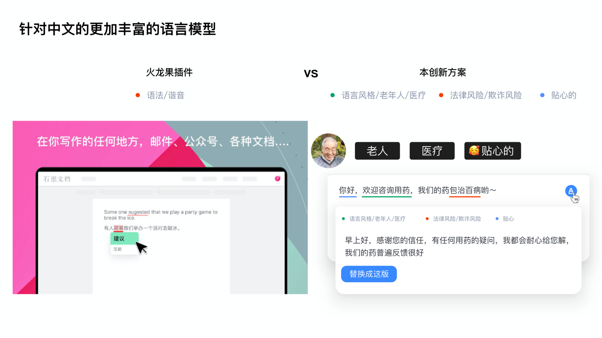

# Enhancing E-commerce Replies with Warmth and Personalization

### Project Brief
- Date: Dec 2021 – Mar 2022
- Project Name: Enhancing E-commerce Replies with Warmth and Personalization
- Tag: NLP, Real-time Tone Optimization, Conversational AI
- Company: Alibaba, Team Innovation Proposal

AI-Powered Language Style Transfer for Customer Service

  
### Overview
In e-commerce chat scenarios, tone matters as much as accuracy. Yet most customer-service agents—especially newcomers—struggle to adapt their language style to different users (elderly, children, professionals, etc.).
This project proposed an AI-driven plug-in that dynamically adjusts tone, empathy level, and language warmth during real-time conversations, helping agents communicate naturally and consistently.

### Problem
- Inconsistent tone across agents leads to misunderstandings and customer complaints.
- Switching between communication styles (e.g., formal → friendly) is time-consuming.
- Existing NLP tools (Grammarly, Outwrite) optimize grammar, not emotional expression—especially in Chinese conversational language.

### Opportunity Insight
As chat-based customer service becomes universal, emotional intelligence in text communication is becoming a core differentiator.
Our goal was to make empathy scalable through intelligent tone adaptation.

### Solution
A real-time tone optimization plug-in that corrects and personalizes responses as agents type.

### Service Mode Setup
- Audience: Elderly / Children / Women / Men
- Scenario: E-commerce / Education / Healthcare / Insurance / Government / Concierge
- Tone: Passionate / Calm / Humorous / Considerate / Lively / Neutral / Serious
- Add-ons: Sensitive-word alerts & alternative suggestions

### Live Chat Enhancement
While typing, agents can click the icon “A” to instantly review tone. The AI highlights emotional mismatch and suggests replacements—maintaining meaning but improving empathy.

### Technical Architecture
- Built upon Transformer-based NLP models (BART) for Text Style Transfer.
- Input: Original sentence + Language parameters
- Output: Tone-adjusted sentence
- Training data: Crowdsourced rewrite pairs under different tone labels; Machine-mined service dialogues for high-quality text pairs
- Pipeline Option 1: End-to-End rewrite (faster, data-intensive)
- Pipeline Option 2: Core-word-based rewrite (more controllable, scalable)

### Competitive Edge
- Focus: Grammar & spelling → Tone, warmth & empathy
- Language: English → Chinese
- Context: Document writing → Real-time chat
- Output: Correct text → Emotionally optimized response

### Impact
- Reduced tone-related misunderstandings by automating empathy.
- Lowered training time for new agents.
- Enabled consistent brand voice across multilingual service environments.
- Provided groundwork for commercial AI tone-transfer APIs in customer service.

