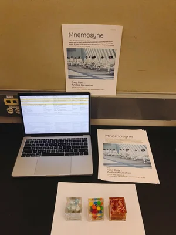

# Food Memory

### Project Brief
- Date: 2019.11
- Project Name: Food Memory
- Tag: speculative design, food design, sci-fi movie
- Company: Parsons School of Design

---

### Project Overview
Mnemosyne is a speculative design project that uses personal food memory data to recreate artificial food and critique contemporary eating trends.

### Artificial Food Iterations

### Interaction Gesture
The gesture for audiences to reach this project is through "scanning".

