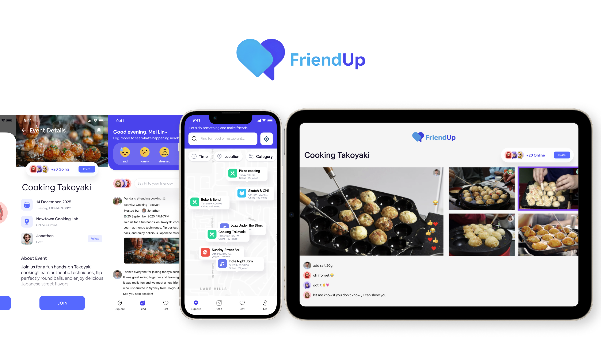
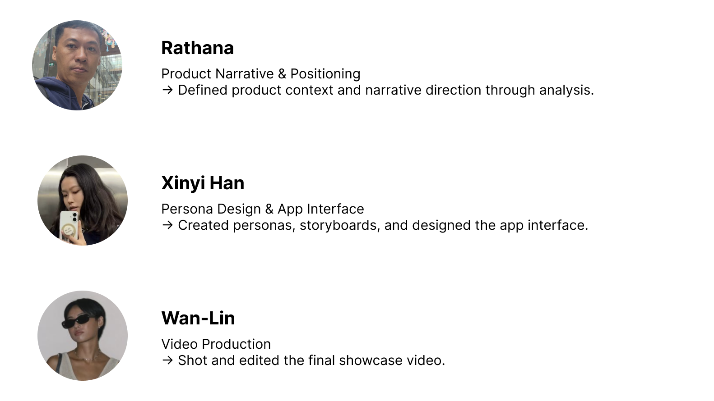
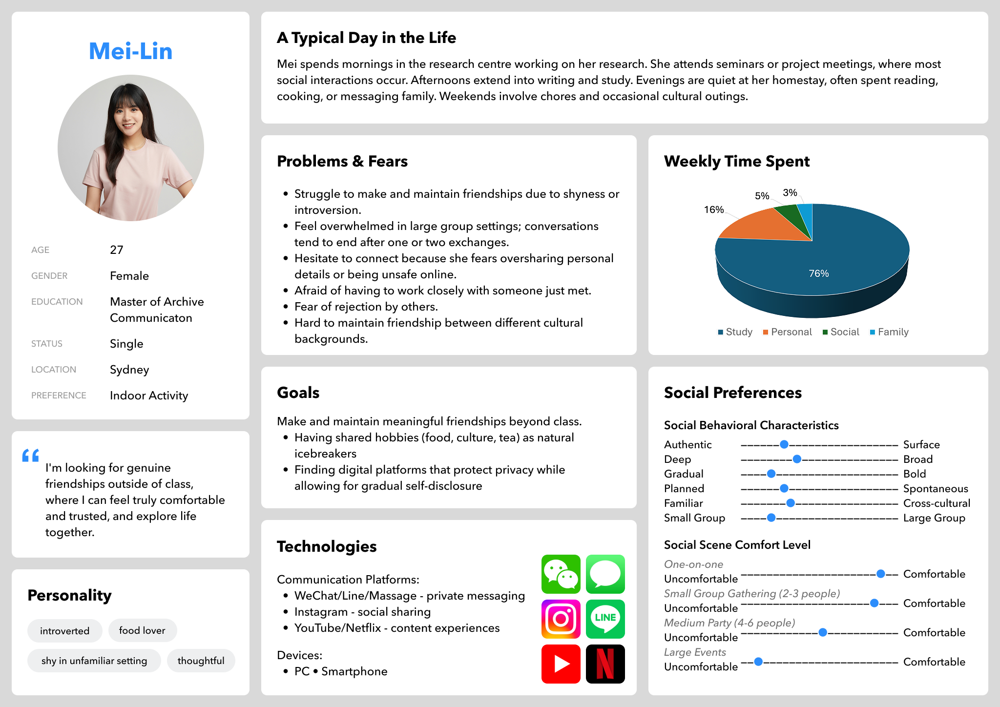
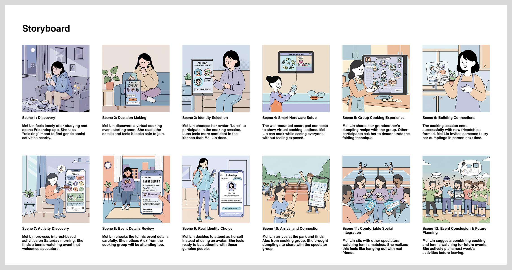
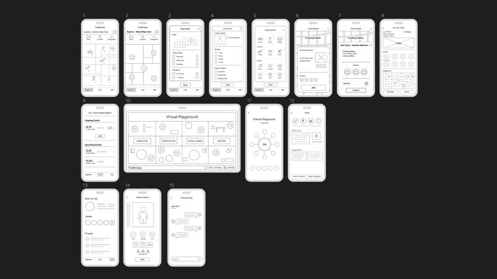
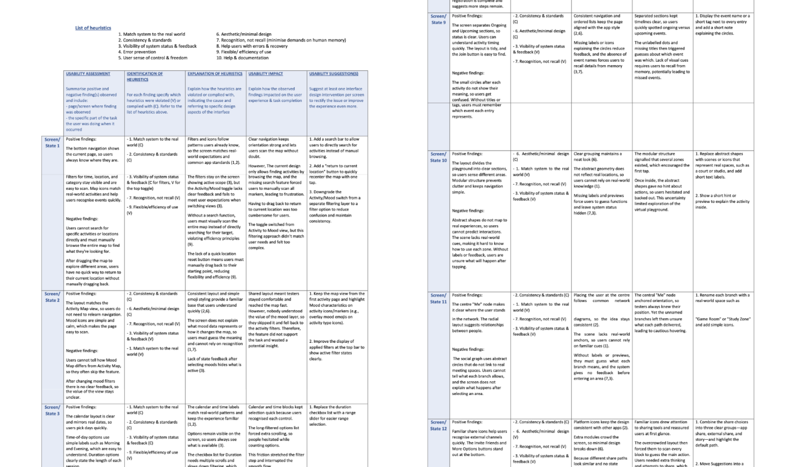
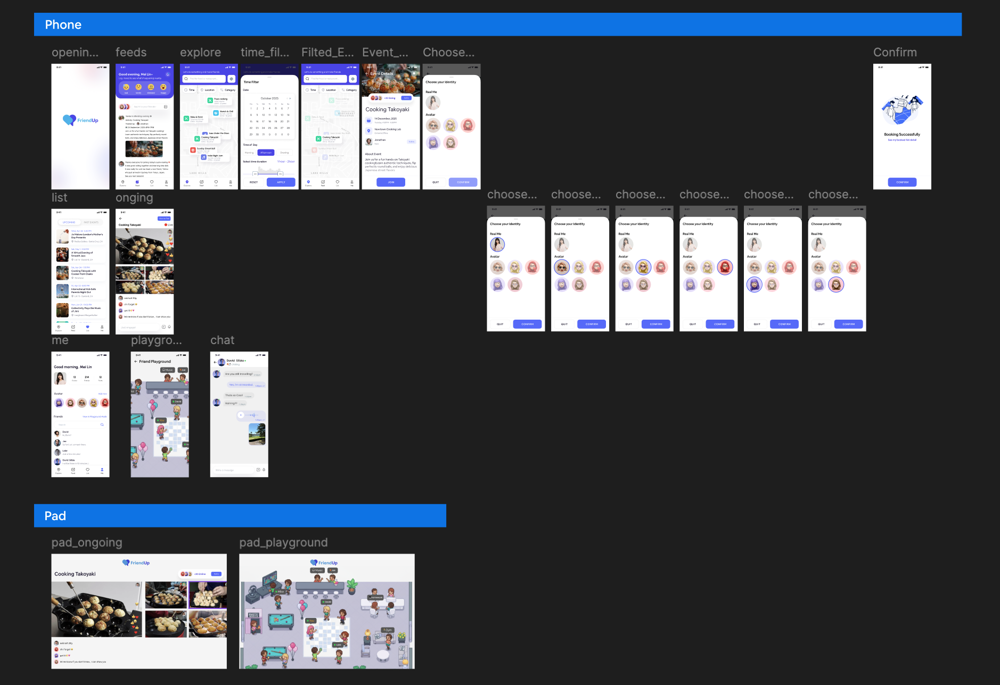

# FriendUp

### Project Brief
- Date: 2025.10
- Project Name: FriendUp
- Tag: UX Design, Social Wellbeing, International Students, Privacy, Usability Testing
- Company: UTS

### Introduction

FriendUp is a social wellbeing app designed for international students to overcome the challenges they face in maintaining friendships in a new environment. Through comprehensive research and official interviews, we identified real-world problems international students encounter when making and sustaining meaningful relationships.

The research revealed five main concepts: difficulties in keeping friends, worries about trust and privacy, sense of loneliness, the impact of academic and professional demands on social life, and the significance of food and hobbies in forming relationships.

#### Group

### Research Insights

Students face significant challenges in sustaining meaningful friendships beyond classroom interactions. While most students can initiate conversations during class or projects, these relationships often fade due to tight schedules or social anxiety.

#### Key findings from our research:

- *Privacy Concerns*: Students prefer to connect in protected settings rather than engaging on mainstream social media platforms like Instagram or WeChat, demonstrating the need for a platform where users control information disclosure
- *Social Isolation*: Many introverted students suffer from loneliness and isolation, with traditional coping strategies like calling family proving insufficient
- *Time Constraints*: Students struggle to balance social life with employment and academic commitments, leaving little time or energy for socializing
- *Interest-Based Connection*: Students expressed interest in productive social activities such as study groups or co-working sessions to build lasting relationships

### Persona

Mei-Lin, a 27-year-old international student pursuing her Master's degree in Archive Communication in Sydney, represents our target user. She spends days studying alone or attending small seminars in formal settings. While she wants to make friends, she is concerned about safety and privacy and lacks confidence in starting and maintaining conversations.

### Problem Scenario

Mei-Lin's daily life reflects the challenges our research uncovered. During group discussions, she becomes quiet, worried about saying the wrong thing or not being understood, especially on unfamiliar topics. After such encounters, she returns home feeling drained, replaying conversations and wishing she could connect more easily.

Evenings feel exceptionally long as she scrolls through Instagram seeing others with lively social lives while isolated in her room. Being away from family with no friends to share moments with, she feels emotionally hurt and disconnected. Over time, this pattern has led to anxiety and loss of motivation to join social activities.

What Mei-Lin lacks is not opportunity but confidence and safe space for interaction. She needs gentle, gradual ways to meet people who share her interests such as cooking or language exchange, with low social pressure and privacy protection.

### Solution: 

####Future Use Scenario

One evening, Mei-Lin receives a notification from FriendUp about a new virtual cooking event. The app shows clear event details, safety ratings, and participant profiles, helping her feel confident to join.

Before joining, Mei-Lin selects her avatar "Luna" to represent herself in the session. Using the avatar makes her feel relaxed because she can participate without showing her real identity at first. During the cooking class, she follows instructions, chats with other participants, and gradually becomes comfortable interacting online. By the end, she exchanges friendly messages with others.

After joining more activities through the app, Mei-Lin gains confidence and becomes more active socially. Eventually, she joins an in-person tennis event as herself instead of using the avatar. She feels proud of this growth and plans to organize her own event through FriendUp to help other students connect.

### Storyboard

The storyboard illustrates Mei-Lin's journey from isolation to connection through FriendUp, showing how the app facilitates gradual confidence building through avatar-based virtual interactions leading to real-world connections.

### Key Insights & Features

#### Insights
FriendUp promotes sociability that extends beyond simply "meeting new people." It emphasizes meaningful relationships through:

- Natural interaction around common interests
- Privacy-respecting connection building
- Low-pressure social environments
- Support for both virtual and in-person engagement
- Gradual confidence building for introverted users

The design ultimately enables international students to create and sustain friendships that respect their time, privacy, and individuality in a friendly and encouraging way.

#### Features
- *Mood Check-In System*: Daily emotional tracking to understand user wellbeing
- *Interest-Based Events*: Virtual and in-person activities around shared interests (food, study, sports, hobbies)
- *Avatar System*: Privacy-first representation allowing gradual identity disclosure
- *Safety Ratings*: Transparent event and participant information for confident participation
- *Local Event Alerts*: Real-time notifications for nearby social opportunities
- *Multilingual Support*: Translation tools to support international student conversations

### Prototype

#### Paper Prototype 

#### Test & Report
Prototype Test
https://www.youtube.com/watch?v=FXlRv7YODmM&feature=youtu.be

Analysis & Report

### Final Design

### Scenario Video
https://www.youtube.com/watch?v=ErEPhlpMzvY
