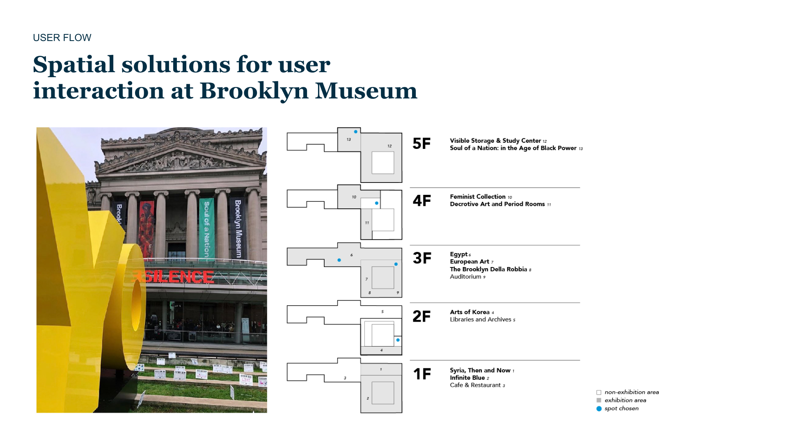
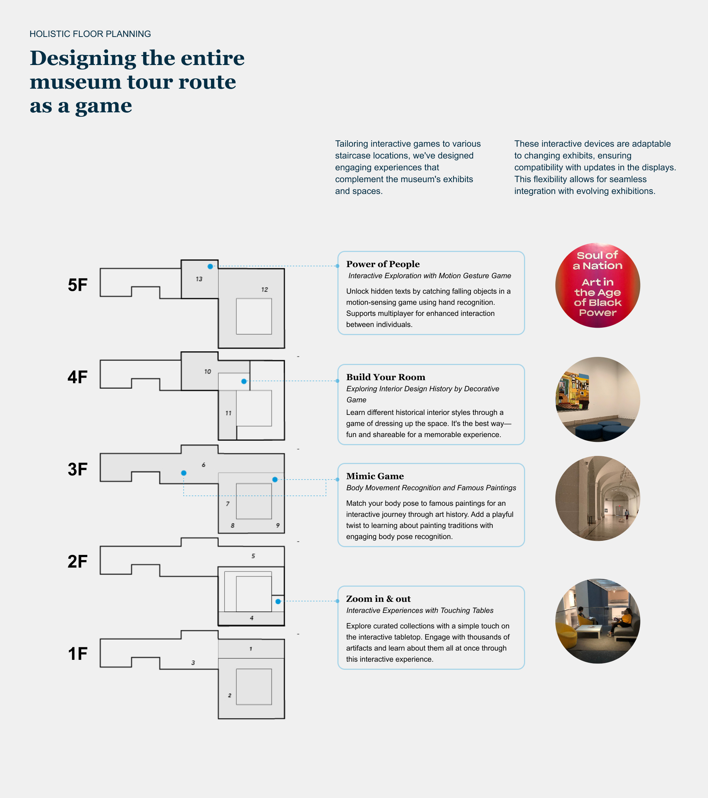
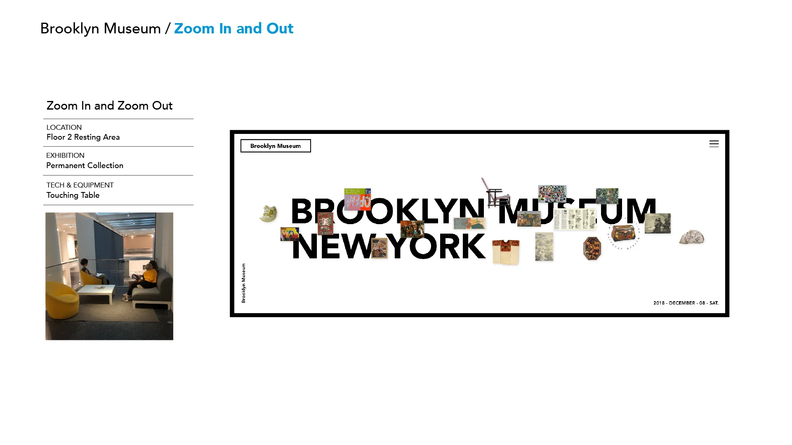
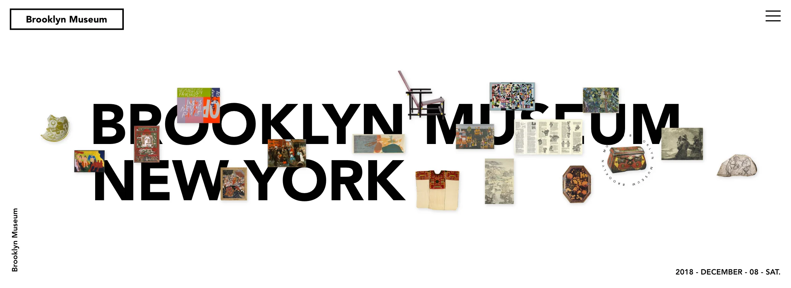
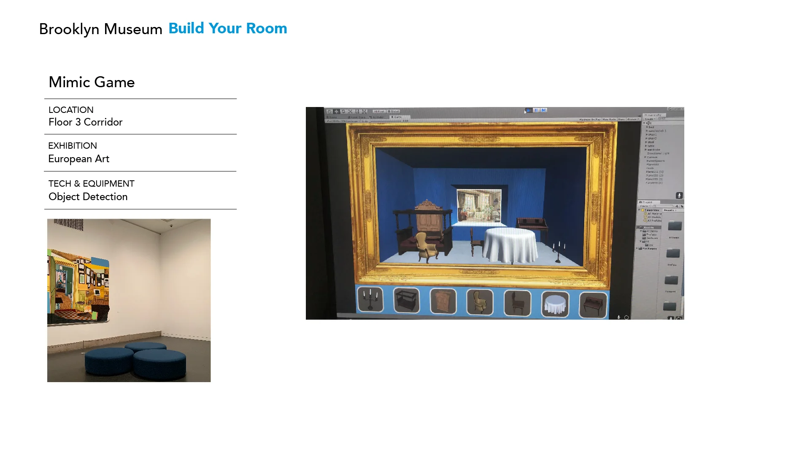
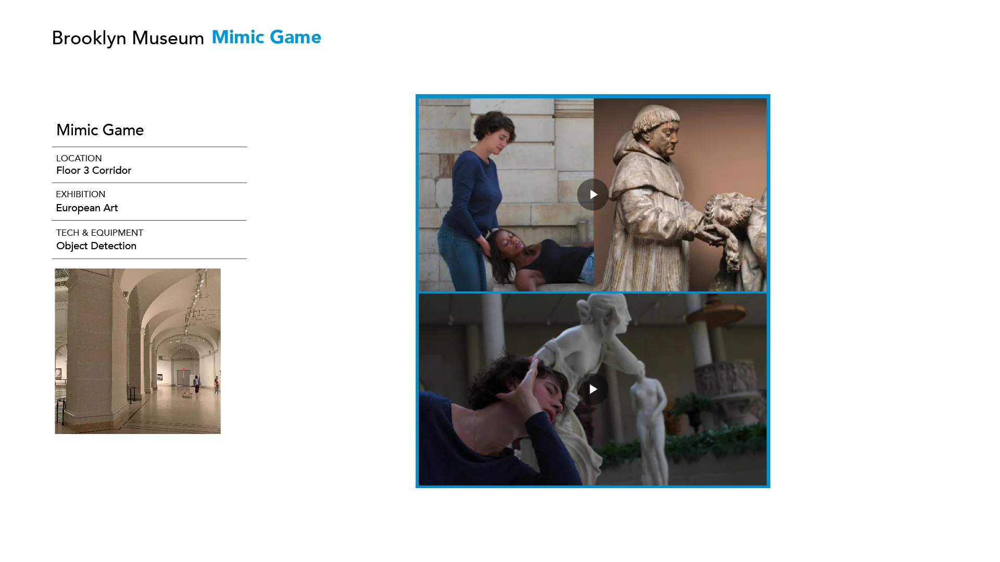

# Design Museum Tour as a Game

---

### Project Brief
- Date: 2018-12-30
- Project Name: Design Museum Tour as a Game
- Tag: Experience Design, Museum Interaction
- Company: Brooklyn Museum, Parsons

###Overview
####Reimagining the Museum as a Living Game

“Brooklyn Museum Redesign” explores how a museum visit can feel like playing a meaningful game.
Instead of treating museum upgrades as isolated interface improvements, this project takes a holistic approach — rethinking the entire visiting journey as a game-based learning system.

By blending spatial design, interaction, and narrative, the museum becomes a living platform where visitors are not passive observers but active players, discovering meaning through play, emotion, and connection.

###Design Approach

####From Observation to Participation

As a passionate museum-goer who has visited dozens of institutions across New York, I was drawn to the Brooklyn Museum — not only for its art but for its role as a cultural connector within the Brooklyn community.

Rather than designing new digital touchpoints, this project treats the museum as a living ecosystem, where every space, interaction, and narrative layer forms part of a cohesive experience.
By applying game design logic to spatial flow and visitor motivation, the project transforms the museum into a place of exploration, curiosity, and co-creation.

###Game System & Interaction Model

####Turning Architecture into a Mission Map

At the heart of the project lies a layered mission system inspired by the museum’s architecture.
Each floor represents a chapter of play — visitors move upward through the building as they progress through different stages of interaction.
Each level is marked by a checkpoint, encouraging reflection, discovery, and participation.

This structure transforms the museum into a narrative journey — from attention to embodiment, from creation to community.
By the time visitors reach the top floor, they complete a loop between personal experience and collective meaning.

###System Overview: Journey Map

The Brooklyn Museum Journey Map connects all five floors through integrated technologies — sensors, projectors, scanners — creating a seamless flow of interactive learning.
Each level offers a unique mode of engagement tied to its collection and atmosphere.

Floor	Theme	Technology	Experience
1F–2F	Zoom In & Out	Touchscreen, Scanner, Sensor	Educational, Self-Discovery
3F	Mimic Gesture	Projector, Camera, Sensor	Embodied Learning, Expression
4F	Build Your Room	3D Model Game	Deep Exploration, Personalization
5F	Power of People	Object Recognition, Motion Effect	Social Interaction, Community

###Layered Game Experiences
1F–2F — “Zoom In & Out”
####Concept:
Visitors start their journey by exploring the details of art and material. Inspired by the museum’s historical collections, this floor invites a slow and sensory start.

####Interaction:
Touch screens and scanners let users zoom into artifacts and textures, revealing hidden details and stories.

####Learning Value:
By observing closely, visitors practice mindful attention — transforming curiosity into understanding.
📸 Demo: short clip showing zoom interaction on screen

###3F — “Mimic Gesture”

####Concept:
Body meets art. Inspired by portraits and performance pieces, this floor translates expression into movement.

####Interaction:
Visitors mimic gestures captured by cameras; projectors respond by animating or illuminating matching artworks.

####Learning Value:
Observation becomes embodiment — visitors connect emotion, body, and art through playful motion.

###4F — “Build Your Room”

####Concept:
Curate your own narrative. This level turns the museum into a creative playground where visitors design their own exhibition.

####Interaction:
Through a 3D modeling interface, users drag and arrange digital artifacts to build a personal gallery. A soft time limit encourages intuitive decision-making.

####Learning Value:
Visitors learn through creation — discovering meaning by shaping their own spatial story.

###5F — “Power of People”

####Concept:
The journey culminates in collective participation. Inspired by Brooklyn’s community spirit, this floor celebrates human connection.

####Interaction:
Using motion and object recognition, visitors create collaborative projections — merging silhouettes, patterns, and data into shared visuals.

####Learning Value:
This level highlights identity, empathy, and social belonging. Visitors see their presence contribute to a collective cultural landscape.

###End of Journey — “Record & Reflect”

Before leaving, visitors bind their account and receive a personalized digital record — a timeline of their exploration and interactions.
This transforms the museum visit into a meaningful digital memory — bridging physical experience with lasting reflection.

###Reflection & Future Directions

####From Playful Engagement to Cultural Systems

The Brooklyn Museum Redesign demonstrates how game-based thinking can reshape cultural learning.
By linking interaction, curiosity, and emotion, the project reframes museums as living ecosystems of participation.

Looking forward, this approach could evolve into a toolkit for future museums — adaptable to different institutions and communities.
It invites designers, educators, and technologists to collaborate on new ways of connecting people and culture through play.

Ultimately, the project asks a simple but transformative question:

**What if learning could be as engaging as play — and culture could be experienced as a living game?**