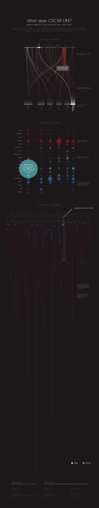

# How Are Oscars Biased?

### Project Brief
- Date: 2018.12
- Project Name: How Are Oscars Biased?
- Tag: Academy Awards, Bias
- Company: -

### Acting Roles That Showcase Difficulty
If you want to win an acting Oscar, choose a role that lets the performer demonstrate obvious technical skill. Playing a character with a disability is a proven path: think of Christy Brown with cerebral palsy in *My Left Foot* (1989) or Raymond Babbitt on the autism spectrum in *Rain Man* (1988). These performances telegraph the craft involved, signaling prestige to voters.

Reference
0.5 

Data from IMDB
0.5 

### Issue-Driven Narratives And The Oscar Voter
Oscar voters also reward films that tackle social issues from a liberal, uplifting angle. Compare *Driving Miss Daisy* and *Do the Right Thing*, both released in 1989. The former won four Oscars, including Best Picture, by presenting race relations in a gentle, conciliatory light. Spike Lee's sharper, more confrontational film secured only two nominations—Best Original Screenplay and Best Supporting Actor—despite its later recognition as a modern classic.
gallery/how-are-oscars-biased/public/black.png

