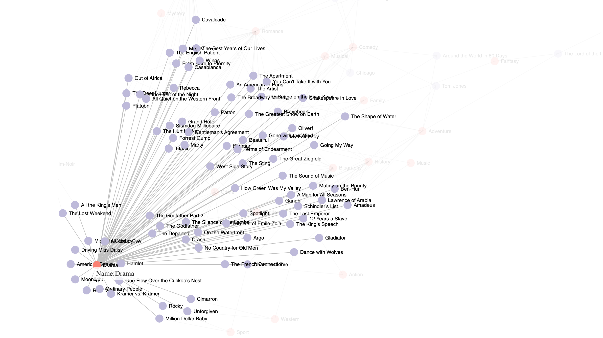
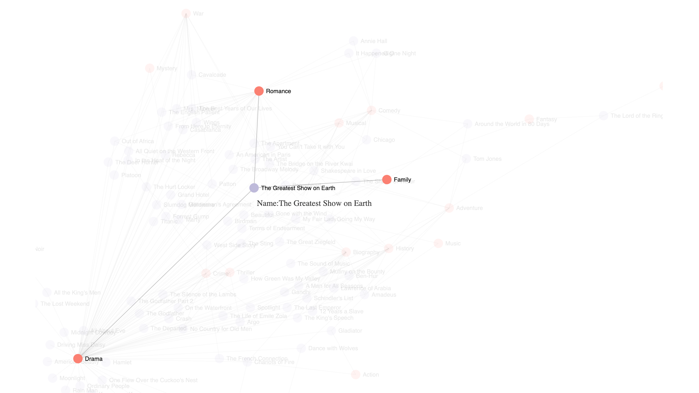

# How Are Oscars Biased?

### Project Brief
- Date: 2018.12
- Project Name: How Are Oscars Biased?
- Tag: Data Visualization, Poster Design, Node.js
- Company: -

### Overview
This project was one of my early experiments with data visualization—an attempt to use visual form to reveal patterns that are otherwise hard to articulate. Inspired by the idea that “a visualization becomes insightful when the structure itself speaks,” I wanted to examine common assumptions about what types of performances tend to win acting Oscars.

### Acting Roles That Showcase Difficulty
**A Graphic Exploration of Patterns Behind Award-Winning Roles**
If you want to win an acting Oscar, choose a role that foregrounds visible technical difficulty. Playing a character with a disability, for instance, has long been a reliable path: Christy Brown with cerebral palsy in *My Left Foot (1989)*, or Raymond Babbitt on the autism spectrum in *Rain Man (1988)*. These performances make the craft legible, signaling prestige to voters and shaping industry expectations of what “award-worthy” means.

**Reference**

In this project, I treated reference not merely as a citation, but as a way to understand how visualizing data can expose the underlying structure of an idea. Much like wind maps that visualize real-time atmospheric flow—where the shape of the graphic itself naturally reveals geographic logic, monsoon patterns, and seasonal shifts—this project uses visualization to surface the implicit rules behind Oscar recognition.
By simply laying out the data without commentary, the patterns begin to explain themselves: the kinds of roles that win, the narratives that get celebrated, and the gap between “critically beloved” and “Academy-approved.” The visualization becomes an analytical lens, making visible the tendencies we often sense intuitively but rarely see articulated.
Data from IMDB:

### Issue-Driven Narratives And The Oscar Voter
Oscar voters also reward films that tackle social issues from a liberal, uplifting angle. Compare *Driving Miss Daisy* and *Do the Right Thing*, both released in 1989. The former won four Oscars, including Best Picture, by presenting race relations in a gentle, conciliatory light. Spike Lee's sharper, more confrontational film secured only two nominations—Best Original Screenplay and Best Supporting Actor—despite its later recognition as a modern classic.
gallery/how-are-oscars-biased/public/black.png

### Practice
To explore Oscar bias through both structure and relationship, I visualized the same dataset using two complementary methods—one static and hierarchical, one interactive and relational. Together, they uncover different layers of insight that neither approach could fully express on its own.

**Approach 1 — Static Tree Poster (Macro-Structure)**
The tree poster presents a top-down structural view of the patterns behind Oscar-winning films. By organizing the data into branching pathways—performance difficulty, disability roles, issue-driven narratives, and tonal framing—the visualization exposes the “award logic” at a glance. The form highlights how certain character types and storytelling strategies consistently align with recognition from the Academy.

**Approach 2 — Interactive Node Graph (Micro-Connections)**
The interactive node.js force-directed graph provides a bottom-up, exploratory view. Each node represents a film, and hovering reveals its connections to others through shared award-winning traits. The network layout captures natural clustering: groups of films connected by similar role challenges, moral framing, or narrative positioning. This approach invites discovery, showing how individual titles relate to broader award tendencies.

[Interactive Node Graph](https://hancyhxy.github.io/new/)

