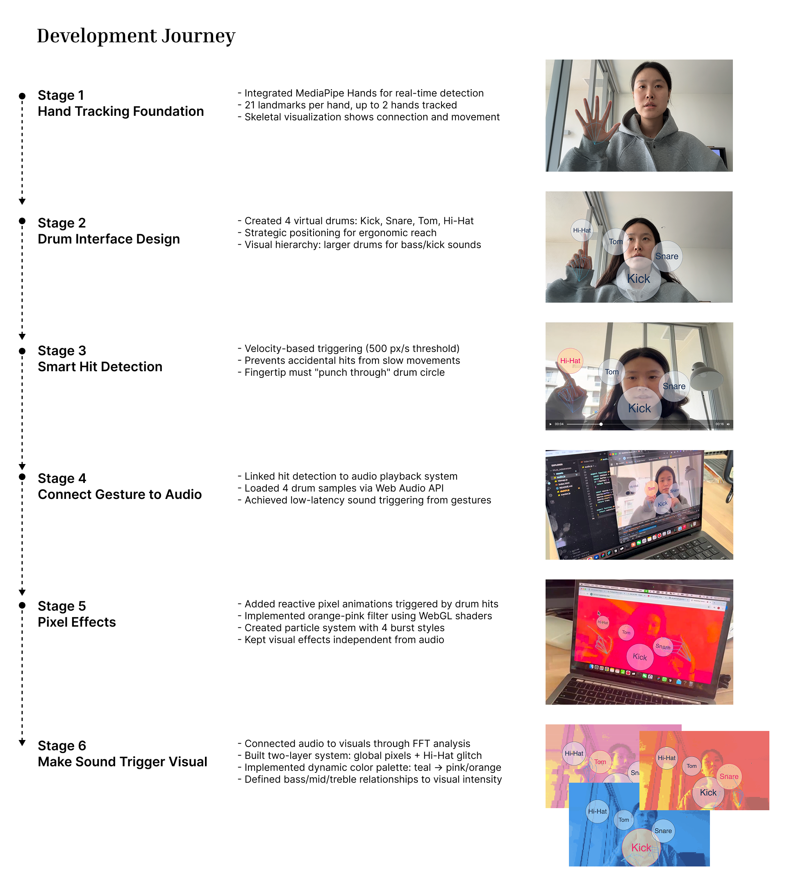
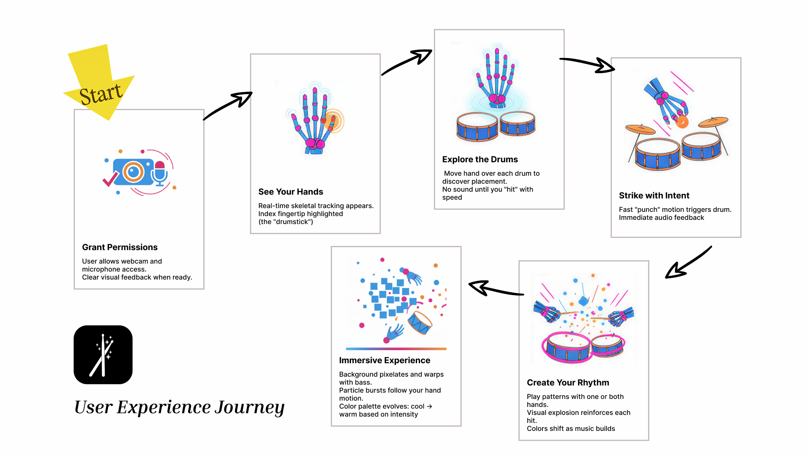
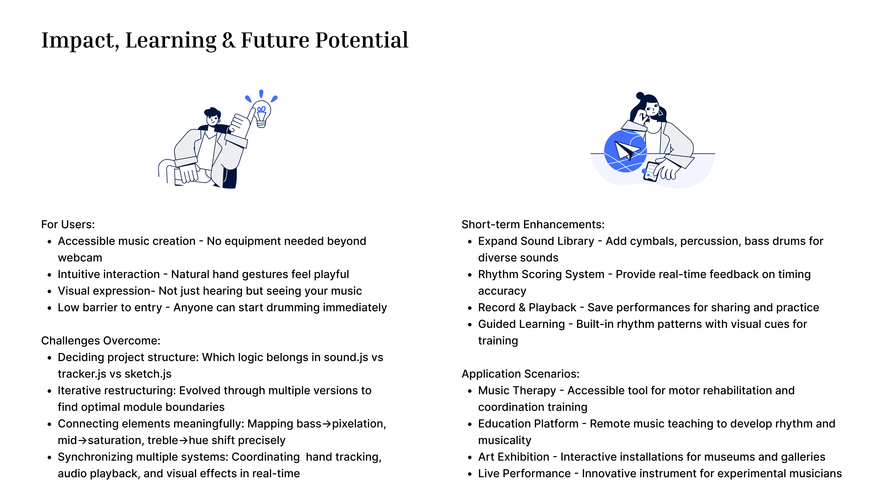

# Interactive Visual Drum Kit

### Project Brief
- Date: 2025.11
- Project Name: Interactive Visual Drum Kit
- Tag: Media pipe, HTML/CSS, P5js, Interactive Music
- Classification: Experiential
- Company: UTS

### Concept
My project is an Interactive Visual Drum Kit that transforms your webcam into a musical instrument. 
Instead of using a mouse or keyboard, you play drums by moving your hands through virtual drum pads. 
The system combines hand tracking with audio-reactive pixel visual effects, creating an immersive experience where every gesture produces both sound and dynamic visuals.

#### Experience Goals
- Deliver a playful, performance-ready interface that works anywhere with just a laptop.
- Fuse motion tracking, percussive audio, and GPU-generated effects so sound and visuals feel inseparable.
- Offer a production-grade demo that can scale into installations, remote jam sessions, or educational tools.

### Development Stage

### System Architecture

### User Journey

- First, you grant webcam and microphone permissions. Immediately, you see your hands tracked in real-time with a blue skeletal overlay your index fingertip becomes your drumstick. 
- As you explore, you can move your hand over the drums without triggering them. To actually play, you need to strike with intent - a fast punching motion. 
- As you build rhythm, the entire scene responds - the background pixelates with the bass, colors shift from cool teals to warm oranges, and the visuals create an immersive musical experience.

### Show Case

Open the link to experience it 👏 (allow the camera and microphone permissions).
[https://hancyhxy.github.io/virtual_band/](https://hancyhxy.github.io/virtual_band/)

### Impact, Learning & Future Potential

