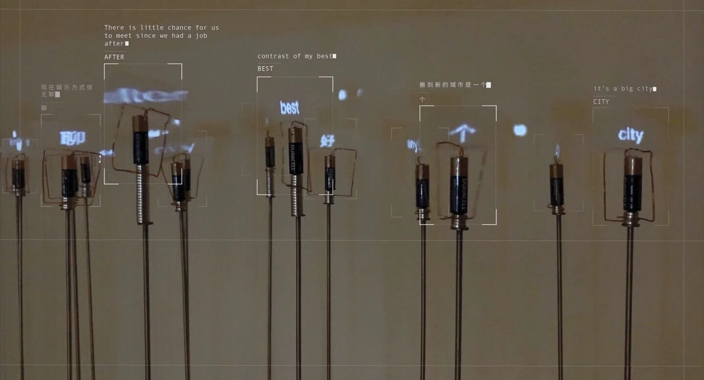
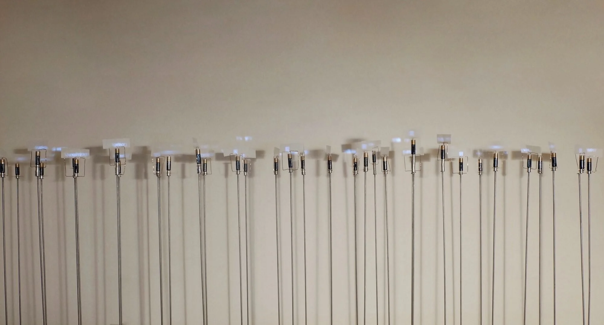
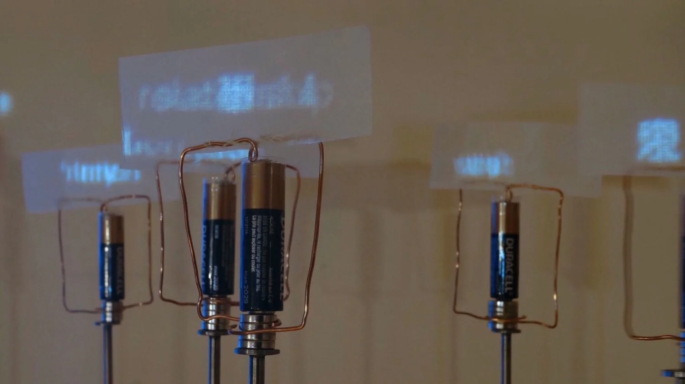
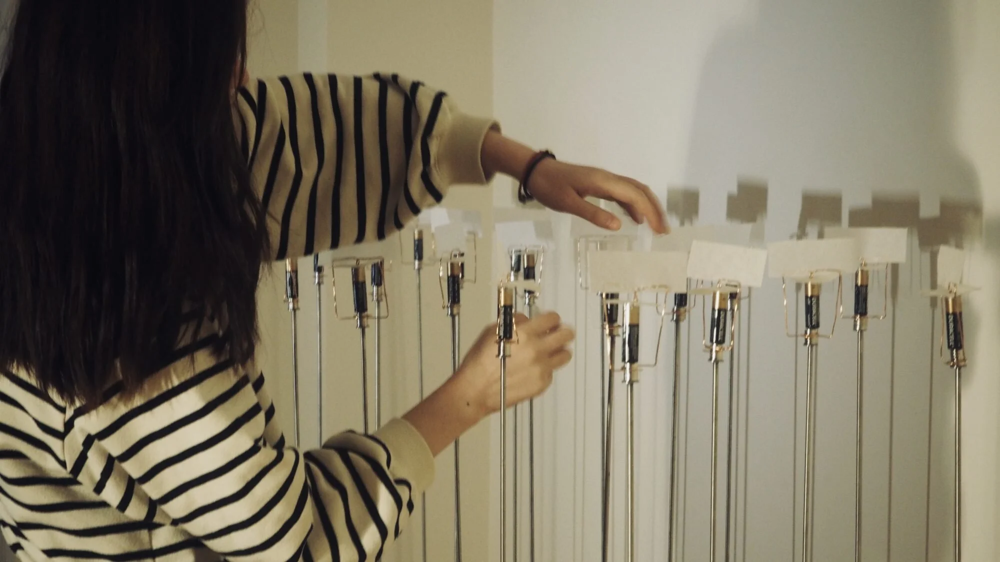

# My friends are my power station

---

### Project Brief
- Date: 2020-05-30
- Project Name: My friends are my power station
- Tag: Installation, Urban Culture
- Company: Parsons School of Design

My friends are my power station. It is​ an installation about loneliness in big cities. This installation employs a large number of units of spinning wire, with statements about intimate relationships projected onto the spinning surfaces. These words, and the battery units that propel them, form a poetic, subtle, and interactive understanding of loneliness and transience. By making loneliness more visible, and shared in a public platform, this work also aims to send a central message to viewers: you are not alone.

[Watch the installation video on Vimeo](https://vimeo.com/417398448?fl=pl&fe=sh)

The title "My friends are my power station" is the story of my friend Yu Tian. When she went through a recent heartbreak, she would take a 2-hour train ride to her best friend's home, talking with her on her sofa all night. After spending this time with her friend, she felt better and more energetic.

I selected key quotes from their stories and projected the sentences on a flat paper surface attached to the spinning battery structures. The result was that a single word appeared each time the structure would spin. Upon first glance, this installation may look separated and undecipherable because different words appear and change each second. However, once viewers focus on one rotating unit, waiting for the changing words to converge as sentences, the lonely message spelled out in these words becomes clear.

This work pairs traditional mechanical materials with digital live stream projection tools to provide an intimate feeling of reading other people's loneliness. It creates a delicate contrast between flashing spinning moments and continuous stories, a single unit encompassed within a large number making up the whole, the singularity of each story set against the industrial rhythm of the structure's rotating movement. When loneliness can be visible and intimated, you are less alone. Through these juxtapositions, I hope that the viewer might relate and feel less alone
