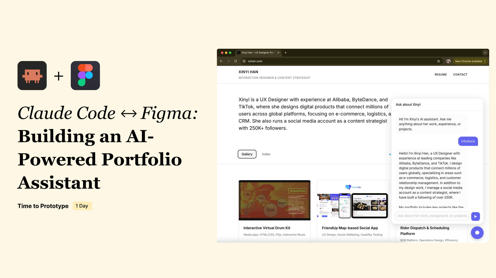
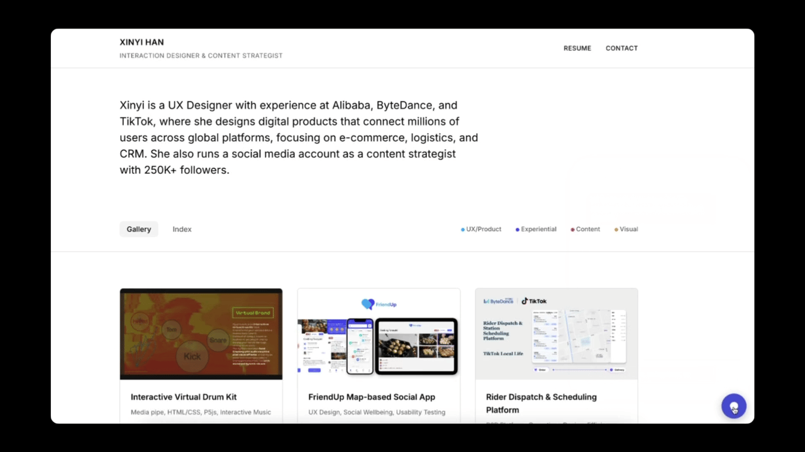

# Claude Code ↔ Figma: Building an AI-Powered Portfolio Assistant

### Project Brief
- Date: 2026.02
- Project Name: Claude Code ↔ Figma: Building an AI-Powered Portfolio Assistant
- Tag: AI, MCP, Product Design
- Company: Personal

### Overview
A personal AI assistant embedded in my portfolio website (bottom-right chat) that helps hiring teams explore my work through conversation—then routes them to verifiable evidence (projects, artifacts, and pages).
 - Local Server: Python built-in HTTP Server (zero dependencies, no need for load balancer or complex infrastructure for local demo)                             
 - AI Model: OpenAI gpt-4o-mini (fast response, low cost, suitable for demo)       
 - Frontend: Vanilla HTML / CSS / JS (no framework, lightweight, consistent with existing portfolio)                                                               
 - Security: API Key stored in local .env, proxied via Python server (prevents key exposure in frontend)  

### The Problem
A portfolio is a one-way presentation. A hiring team can scroll through it, but they can't ask follow-up questions, dig into a specific decision, or understand the person behind the work — not without scheduling a call.

I wanted to close that gap: let anyone visiting my portfolio have a real conversation with it, the same way they would with me.

### The Approach

**Scope**: This was a fast, focused demo—built in 1 day to prove two independent things.

- **AI-native workflow** — that a Claude Code → Figma → Claude Code loop is a real, shippable way to work
- **AI-native product design** — that an assistant built for hiring teams needs guided discovery, not a blank chat box

---

### 1. AI-native workflow: Claude Code → Figma → Claude Code

I used a Claude Code → Figma → Claude Code loop to go from idea to working demo in one day. The screen recording below shows how this works in practice.
0.7 

The key was the Figma MCP integration with Claude Code. Through MCP, code and design stay connected — and as a designer, I maintained proper design variables and tokens throughout the process, so the output isn't a rough sketch. It's a pixel-perfect Figma file, generated seamlessly from the working codebase.

This workflow meant I could prototype in code, refine in design, and ship back to production without handoff delays.

---

### 2. AI-native product design: A Structured Self-Narrative System
I prototyped a working chatbot quickly — a general assistant scoped to my portfolio, where hiring teams could ask anything about my work.
0.7 

But a general chatbot — like ChatGPT or Grok — is built for open-ended conversation. That works for broad tasks, but not here. In this specific scenario, the goal is much narrower: help a hiring team understand one person quickly.

So beyond the free-form chat, I needed an **information system** — one designed around how I want to present myself, not just what someone happens to ask.
0.7 

For the interaction design, I started from the hiring team's perspective: what does someone actually do when they open this chatbot? They're trying to understand a person — their background, their experience, their work. So I structured the entry points around those three scenarios (Career Path / Projects / Design Thinking) rather than leaving the prompt fully open.

Within that, Projects was the hardest to get right — and the most important to get right quickly. With many projects across different domains, the real question for a recruiter isn't "what kind of work did she do?" — it's "has she worked on something like mine?" Organising by job category (UX / Social Media) doesn't answer that. Organising by industry keyword does.

So instead of content-type labels, I organised Projects around industry keywords — the same tags already maintained in `gallery.json` for each project. The AI reads these directly, so there's no separate taxonomy to maintain. Each tag was written from the recruiter's vocabulary, not mine:
- **B2B / Operations** → Rider Dispatch, Customer Service Workspace
- **AI & Chatbot** → Customer Service Chatbot, E-commerce Replies (NLP)
- **Consumer App** → FriendUp, Content-Driven Food Delivery
- **Content & Growth** → KOL Growth Strategy, Global 1M Audition
0.7 

### Summary

This project started as a one-day concept: could I build a working AI assistant for my portfolio, and could the workflow itself demonstrate how I work?

The answer was yes — on both counts. I prototyped an interactive AI assistant using a Claude Code → Figma → Claude Code loop, proving that code-first design iteration can go from idea to shippable product in a single session. At the same time, I designed a structured self-narrative system — guided entry points, industry-keyword navigation, and recruiter-first interaction patterns — that turns a portfolio from a static showcase into an evaluable conversation.
