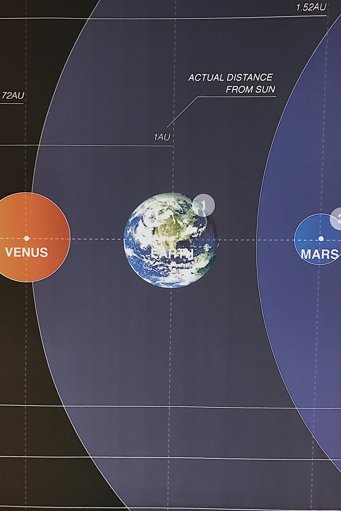
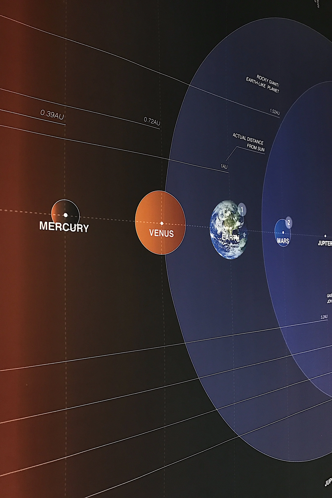
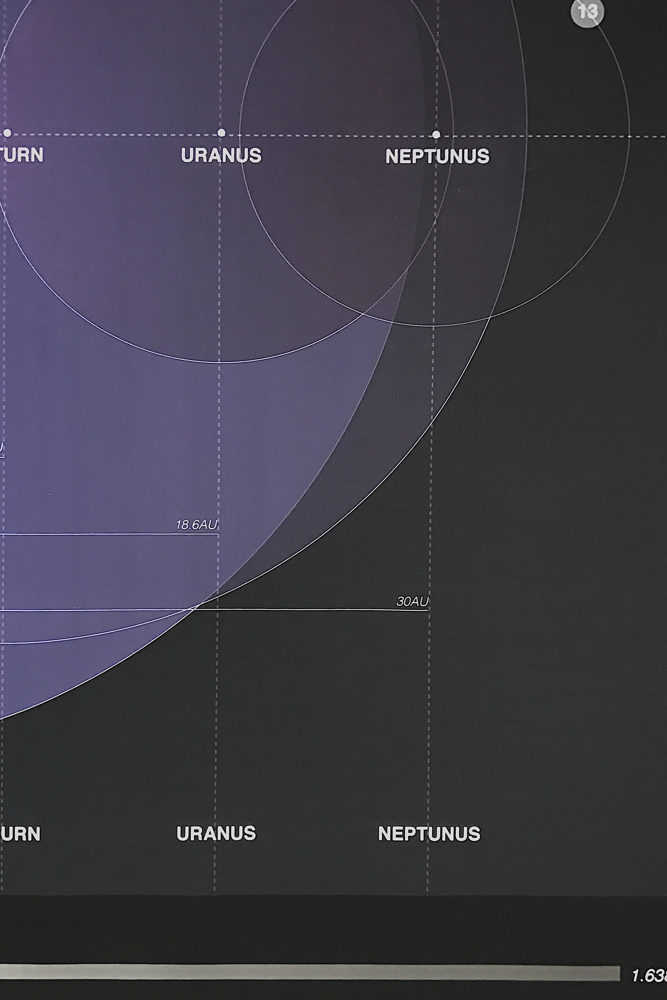
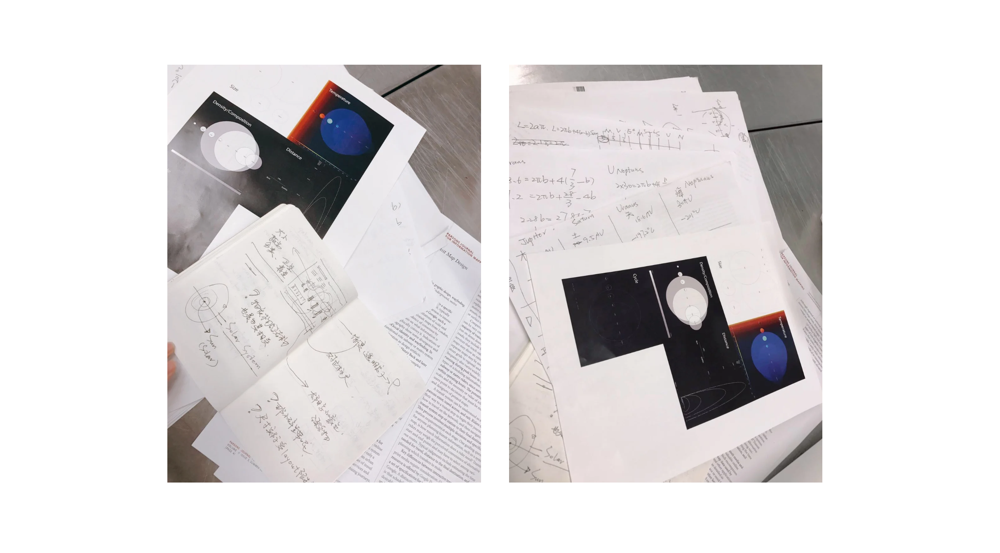

# Relationship of the Eight Planets in Solar System

### Project Brief
- Date: 2018.11
- Project Name: Relationship of the Eight Planets in Solar System
- Tag: Data Visualization, Poster
- Company: Parsons School of Design

With Newtonian mechanics alone, the celestial positions in the solar system are infinitely many solutions.       Therefore, physicists have still exclaimed: "The first time to promote the results"

0.7 
0.7 
0.7 

### Process

