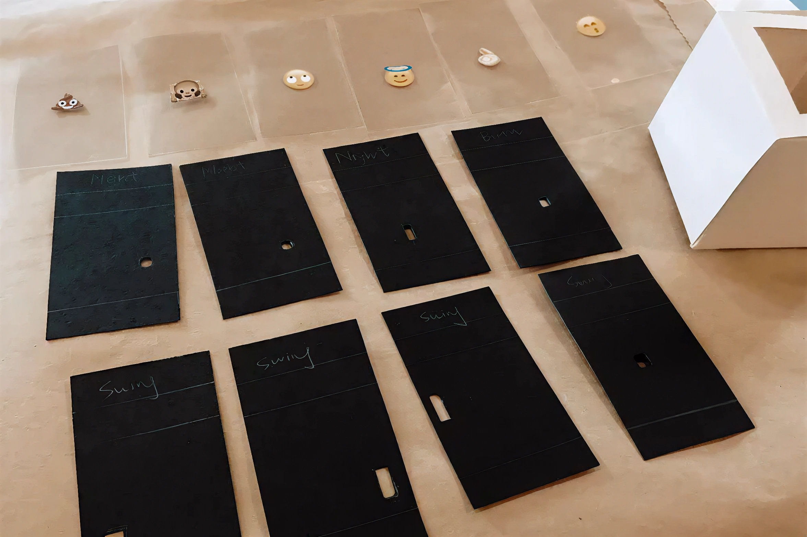
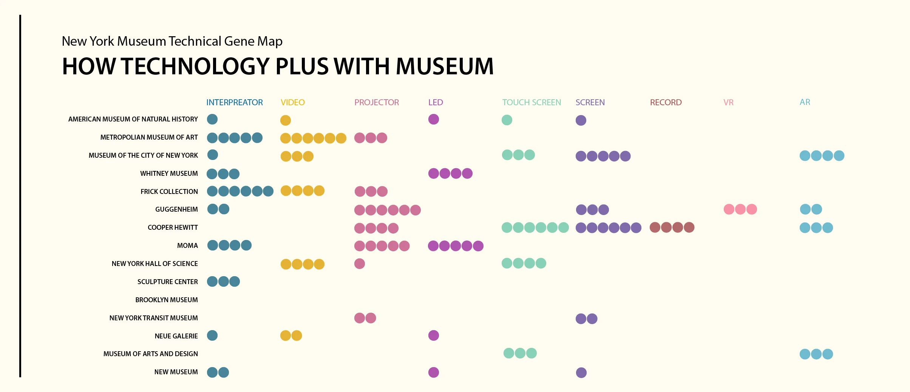
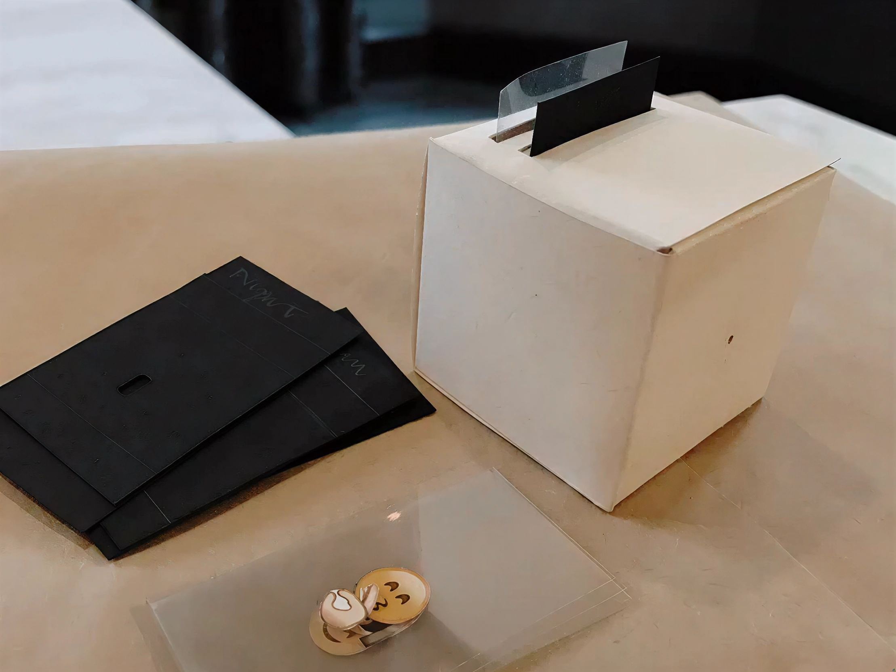
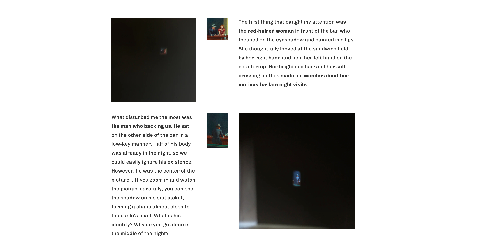
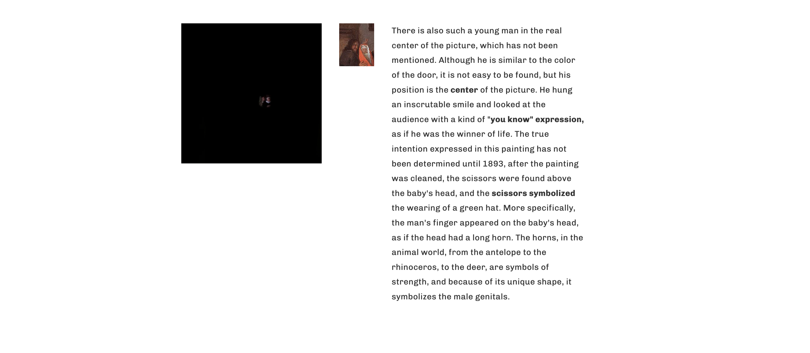

# The Museum Kit — Reframing Art through Interaction

### Project Brief
- Date: 2018.11
- Project Name: The Museum Kit — Reframing Art through Interaction
- Tag: Interaction Design, Museum, Experience Design
- Company: -

### Overview
This project reimagines how people engage with museum artworks.

Instead of passively viewing paintings from a distance, visitors are invited to observe, question, and discover — using a small interactive viewing kit that reveals details through physical manipulation.

The kit consists of a paper cube with a peephole, paired with a set of insertable black cards labeled with keywords such as “Night”, “Swing”, or “Brain.”
Each card corresponds to a specific perspective, lighting, or emotion found within a painting. By inserting a card and peering into the box, users uncover new layers of meaning — encouraging slow looking, curiosity, and emotional resonance.

### Background
Museums are spaces of knowledge and memory — places that help people access history through experience.

However, modern visitors face three common issues:

- Fragmented attention: seeing too many exhibits dilutes memory and emotion.
- Limited interpretation: static text labels can’t convey the narrative depth behind artworks.
- Overuse of technology: excessive screens or effects can distract from the authenticity of real artifacts.

The challenge is to balance tradition and technology, creating tools that enhance rather than overshadow the original works.

### Design Insight
Research into visitor motivations and takeaways revealed that memorable experiences often share four traits:

- They match the visitor’s personal interest or curiosity.
- They present something novel or unexpected.
- They evoke strong emotion.
- They connect to later experiences or reflection.

The Museum Kit responds to these findings by providing personalized, tangible engagement — a quiet, focused exploration where each inserted card changes what the user perceives.

### Examples
#### Example 1

Example 1 – Edward Hopper, Nighthawks (1942)
The scene depicts a diner glowing in the quiet city night. Through the “Night” card, the viewer’s gaze narrows to a red-haired woman at the bar — her bright hair and reflective pose invite speculation about loneliness and desire. Another card highlights a shadowed man whose suit folds form an eagle-like silhouette — subtle details that shift the story from isolation to mystery.

#### Example 2
Example 2 – Jan Steen, Celebrating the Birth

At first glance, the painting shows joyous family celebration. Yet through the “Swing” or “Brain” cards, the viewer notices hidden gestures — a man’s knowing smile, a pair of scissors above a baby’s head, and symbolic “horns” hinting at betrayal and irony. The kit transforms the viewing from simple observation to investigative storytelling.

### Takeaway
The Museum Kit transforms art appreciation into a hands-on act of interpretation.
By merging physical craft, sensory focus, and storytelling, it helps visitors form deeper emotional and cognitive connections with art — reminding us that museums are not just places to look, but places to see differently.
